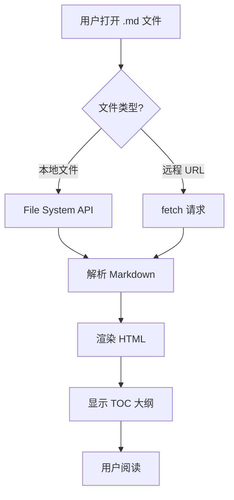
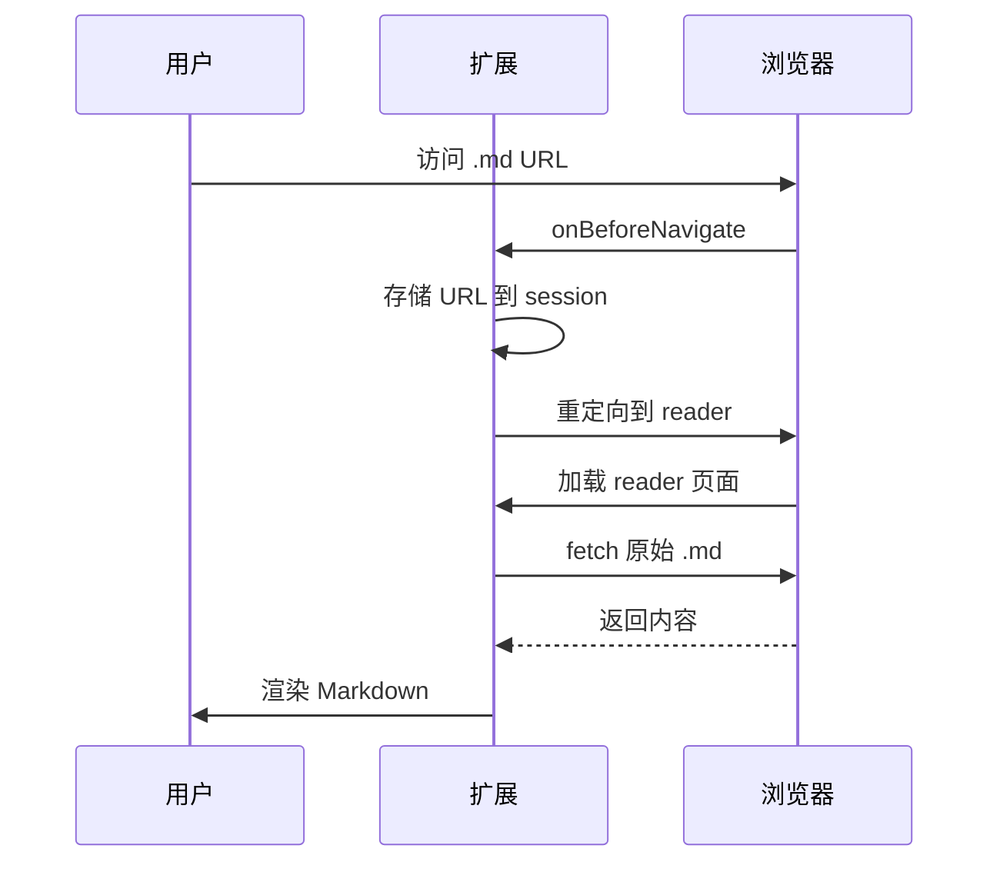

# Markdown Reader 功能演示

11这是一个完整的 Markdown 功能演示文档，涵盖所有支持的语法特性。

## 基础排版

这是一段普通文本，支持 **加粗**、*斜体*、`行内代码` 和 ==高亮标记==。

引用文本使用 blockquote：

> 好的设计是显而易见的，伟大的设计是透明的。

## 数学公式 (KaTeX)

行内公式：质能方程 $E = mc^2$，欧拉公式 $e^{i\pi} + 1 = 0$。

块级公式：

$$
\int_{-\infty}^{\infty} e^{-x^2} dx = \sqrt{\pi}
$$

$$
\frac{\partial f}{\partial x} = \lim_{h \to 0} \frac{f(x+h) - f(x)}{h}
$$

## 代码块

```typescript
interface MarkdownReader {
  theme: 'light' | 'dark';
  export(format: 'pdf' | 'image'): Promise<void>;
}

function parseMarkdown(content: string): ParseResult {
  const headings = extractHeadings(content);
  const html = renderToHTML(content);
  return { html, headings };
}
```

```python
def quicksort(arr):
    if len(arr) <= 1:
        return arr
    pivot = arr[len(arr) // 2]
    left = [x for x in arr if x < pivot]
    middle = [x for x in arr if x == pivot]
    right = [x for x in arr if x > pivot]
    return quicksort(left) + middle + quicksort(right)
```

## Mermaid 图表





## Alert 提示块

> [!NOTE]
> 这是一个注意事项，用于补充说明重要信息。

> [!TIP]
> 使用 `Ctrl + F` 可以在文档中搜索关键词。

> [!IMPORTANT]
> 首次使用时需要授予文件访问权限。

> [!WARNING]
> 不要在公共网络上传输敏感数据。

> [!CAUTION]
> 删除操作不可逆，请谨慎操作。

## 任务列表

- [x] URL 拦截自动渲染
- [x] TOC 大纲 + scroll-spy
- [x] 代码块复制按钮
- [x] 数学公式渲染 (KaTeX)
- [x] Mermaid 图表支持
- [ ] 全文搜索高亮
- [ ] 自定义 CSS 注入
- [ ] 拖拽打开文件

## 表格

| 功能 | 状态 | 优先级 |
|------|------|--------|
| 亮色/暗色主题 | ✅ 已完成 | P0 |
| PDF 导出 | ✅ 已完成 | P0 |
| 代码高亮 | ✅ 已完成 | P0 |
| 数学公式 | ✅ 已完成 | P1 |
| Mermaid 图表 | ✅ 已完成 | P1 |
| 脚注支持 | ✅ 已完成 | P1 |

## 脚注

Markdown Reader 是一个 Chrome 扩展[^1]，支持渲染 GitHub Flavored Markdown[^2]。

核心特性包括：
- 自动拦截 .md 文件 URL[^3]
- 本地文件和目录浏览
- 高质量导出功能

[^1]: Chrome 扩展基于 Manifest V3 开发
[^2]: GFM 是 GitHub 对 Markdown 标准的扩展
[^3]: 通过 `chrome.webNavigation` API 实现

## 列表

无序列表：

- 第一项
  - 嵌套项 A
  - 嵌套项 B
- 第二项
- 第三项

有序列表：

1. 安装扩展
2. 启用「允许访问文件网址」
3. 打开任意 .md 文件
4. 享受阅读体验

---

*感谢使用 Markdown Reader！*
